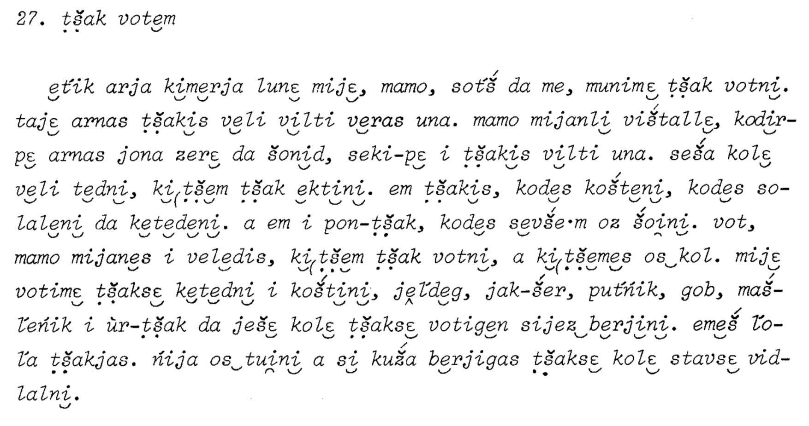

# Syrjänische Texte

This serie of five books was published by Finno-Ugrian Society …

The first three books were produced without computer, so no digital files exist. Some of the texts have been digitalized in Kone Foundation funded project IKDP, and currently different OCR approaches are being investigated. This repository contains the trained OCR models and the training data to repeat the process.

This project, work of which is done within Kone Foundation funded project IKDP-2, explores the possibilities of digital editions of scientific text collections published in 19th century. Different questions are asked in relation to representation, availability, access, integration with language documentation corpora and general methods of digital republishing. The answers are not necessarily provided, and displaying things in internet is a fast moving field, but some solutions are still aimed for.

Since the work is very much done from the modern language documentation point of view, one goal is to provide pipelines that transform the recognized text into an ELAN file, so that there is easy and full searchability with the other comparable resources. However, multiple outputs are very much needed, and one of these should be an HTML file that somehow displays the content in attractive and easily browsed format.

## Reproducibility

    wget https://www.sgr.fi/sust/st/st3.pdf
    mkdir raw
    Rscript extract_pages.R
    ocropus-nlbin raw/*.png -o train
    ocropus-gpageseg --scale 30 'train/*.bin.png'
    ocropus-gtedit html train/*/*.png -o temp-correction.html
    ocropus-gtedit extract temp-correction.html

The models have been trained with following command:

    ocropus-rtrain -c ./train/*/*gt.txt -o st2cyr-01-ae30119 -d 20 ./train/*/*png

The model naming pattern is sequential, so the first number after name is how manieth model this is, and that is followed by the commit number of this repository containing the training files in the state used in model training. Better ideas to arrange this are very welcome, however, ensuring that it is known exactly with what data the model is trained is very important and must be devoted attention. 

## Demo

    ocropus-nlbin demo/st3_p48_27.png -o demo
    ocropus-gpageseg --scale 30 'demo/*.bin.png'
    ocropus-rpred -Q 4 -m st2cyr-01-ae30119-00006000.pyrnn.gz 'demo/*/*.bin.png'
    ocropus-hocr 'demo/*.bin.png' -o demo.html

## References

**TODO:** IKDP project has to be mentioned here, and also there could be BibTex for each Syrjänische Texte book.

